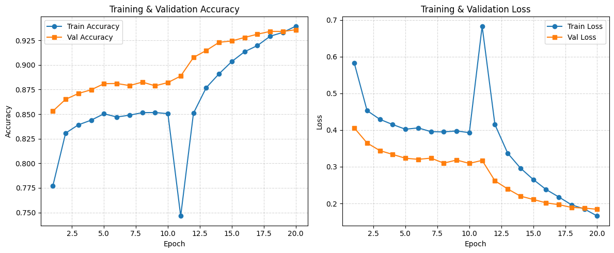

# COVID-19 Chest X-Ray Image Classifier

<p align="center">
  
  
  
  
  
</p>

<h1 align="center">COVID-19 Chest X-Ray Image Classifier</h1>

<p align="center">
A deep learning pipeline built with TensorFlow and EfficientNetB0 for classifying COVID-19 and other lung conditions from chest X-ray images.  
<br>
Achieves <b>93.2% test accuracy</b> with stratified data splits, checkpoint recovery, and Colab GPU optimization.
</p>

<p align="center">
  <a href="https://colab.research.google.com/"></a>
  <a href="https://www.kaggle.com/datasets/tawsifurrahman/covid19-radiography-database"></a>
</p>

---


###  Overview
This project implements a **deep learning classifier** that detects COVID-19 and other lung conditions from chest X-ray images using **TensorFlow / Keras EfficientNetB0**.  
The workflow is fully reproducible and tuned for **Google Colab GPU** environments, with automatic checkpointing and recovery.

---

### Model Summary
| Component | Description |
|------------|-------------|
| **Architecture** | Transfer learning using `EfficientNetB0` (pretrained on ImageNet) |
| **Training Phases** | 1- Feature extractor training (frozen base) 2- Fine-tuning top 30 % of layers |
| **Optimizer** | Adam (1e-3 for Phase 1, 1e-5 for Phase 2) |
| **Loss** | Sparse Categorical Cross-Entropy |
| **Metrics** | Accuracy, Weighted F1, Macro F1 |
| **Augmentations** | Resize → Normalization → Dropout 0.4 |
| **Frameworks** | TensorFlow 2.19 + Keras + scikit-learn |

---

### Results
| Metric | Score |
|--------|--------|
| **Test Accuracy** | **0.9320** |
| **Test Loss** | 0.2005 |
| **Weighted F1** | 0.9319 |
| **Macro F1** | 0.9344 |

#### Per-class Performance
| Class | Precision | Recall | F1-Score |
|-------|------------|---------|----------|
| COVID | 0.98 | 0.97 | 0.97 |
| Lung Opacity | 0.92 | 0.89 | 0.90 |
| Normal | 0.92 | 0.95 | 0.94 |
| Viral Pneumonia | 0.95 | 0.90 | 0.93 |

---

### Dataset Structure
The dataset was stratified into **train / val / test** splits (70 / 20 / 10) with preserved class proportions.

```
COVID-XRay-Split/
│
├── train/
│   ├── COVID/
│   ├── Lung_Opacity/
│   ├── Normal/
│   └── Viral_Pneumonia/
│
├── val/
│   ├── COVID/
│   ├── Lung_Opacity/
│   ├── Normal/
│   └── Viral_Pneumonia/
│
└── test/
    ├── COVID/
    ├── Lung_Opacity/
    ├── Normal/
    └── Viral_Pneumonia/
```

---

### How to Reproduce

#### 1️) Environment Setup
```bash
!pip install tensorflow==2.19.0 scikit-learn matplotlib
```

#### 2️) Mount Google Drive (optional)
```python
USE_DRIVE = True
from google.colab import drive
drive.mount('/content/drive')
```

#### 3️) Run Notebook Steps
Execute sequentially:

| Step | Purpose |
|------|----------|
| **1** | Setup paths, configuration, GPU check |
| **2** | Load & cache datasets (with stratified split) |
| **3** | Build EfficientNetB0 model |
| **4** | Phase 1 – Train classifier head |
| **5** | Phase 2 – Fine-tune base layers |
| **6** | Evaluate on test set |
| **7** | Plot training curves |
| *(optional)* 8 | Grad-CAM explainability (future work) |

---

### Training Curves
> Accuracy and loss across both phases.  
> *(Generated automatically in Step 7)*



---

### Checkpoints & Outputs
All generated artifacts are stored in the `outputs/` directory:

| File | Description |
|------|--------------|
| `best_model.keras` | Best-performing model |
| `last_epoch.keras` | Last saved epoch |
| `covid_classifier_final.keras` | Final fine-tuned model |
| `covid_class_names.json` | Class label mapping |
| `train_history.pkl` | Accuracy/loss history |
| `training_curves.png` | Learning curves |
| *(optional)* `gradcam_*.png` | Grad-CAM heatmaps |

---

### Performance Tips
- Always use **GPU runtime** in Colab (`Runtime -> Change runtime type -> GPU`).
- Copy dataset from Drive to `/content/` before training for faster I/O.
- Use `.cache('/content/train_cache.tfdata')` instead of in-RAM caching to prevent crashes.

---

### Future Enhancements
- Implement Grad-CAM explainability with safer tensor graph handling  
- Try larger EfficientNet variants (B1–B3) or ConvNeXt  
- Deploy as an inference API using TensorFlow Serving or FastAPI  
- Add interactive confusion matrix visualization in Streamlit  

---

### License & Credits
- **Dataset**: COVID-19 Radiography Database (Kaggle, 2021)  
- **Model Base**: EfficientNetB0 pretrained on ImageNet  
- **Author**: *Virendra Pratap Singh - vpsn_99@yahoo.com*  
